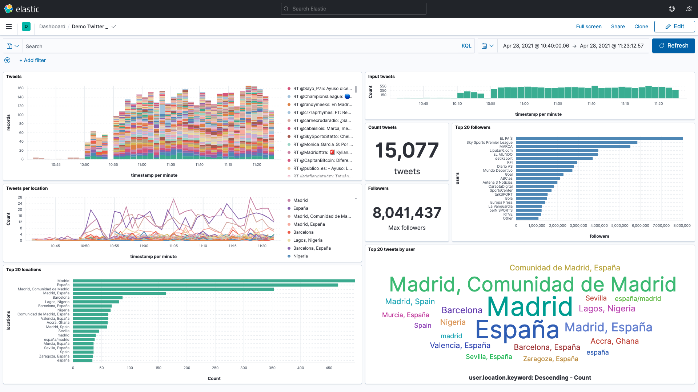

# Demo Twitter Streaming Ingestion

* [Contexto](#contexto)
* [Prerequisitos](#prerequisitos)
* [Pasos para ejecutar `ingestion.py`](#pasos-para-ejecutar-ingestionpy)
	- [Descargar repo](#descargar-repo)
	- [Arrancar plataforma](#arrancar-plataforma)
	- [Cargar dashboard en Kibana (opcional)](#cargar-dashboard-en-kibana-opcional)
	- [Modificar filtros del stream de Twitter (opcional)](#modificar-filtros-del-stream-de-twitter-opcional)
	- [Instalar dependencias](#instalar-dependencias)
	- [Arrancar la aplicación](#arrancar-la-aplicación)
* [Comprobaciones](#comprobaciones)
* [Kibana dashboard](#kibana-dashboard)


## Contexto

Aplicación Python super sencilla para descargar tweets en streaming para luego indexar en [Elasticsearch](https://www.elastic.co/guide/en/elastic-stack-get-started/current/index.html) y publicar en [Kafka](https://kafka.apache.org/intro).

Muy útil para demos donde se requiera de procesamiento o análisis de datos en tiempo real pudiendo usar diversas tecnologías real time.

## Prerequisitos

Crear una cuenta en https://developer.twitter.com y posteriormente una APP para obtener los tokens necesarios y así poder usar la API v1.1.

A continuación exportar estas claves como variables de entorno, en la shell donde vayamos a ejecutar la aplicación python.

```
export CONSUMER_KEY=xxxxxxxxxxxxxxxxx
export CONSUMER_SECRET=xxxxxxxxxxxxxxxxxxxxxxxxxxxxxxxxxxxxxxxxxxxxxxxxxxx
export ACCESS_TOKEN=xxxxxxxxxxxxxxxxx-xxxxxxxxxxxxxxxxxxxxxxxxxxxxxxxxxx
export ACCESS_TOKEN_SECRET=xxxxxxxxxxxxxxxxxxxxxxxxxxxxxxxxxx
```


## Pasos para ejecutar `ingestion.py`

### Descargar repo

```sh
git clone https://github.com/ilittleangel/demo-twitter.git
cd demo-twitter
```

### Arrancar plataforma

```sh
docker-compose up -d
```

Se arrancarán los servicios necesarios para la ingesta

```
Creating elasticsearch ... done
Creating zookeeper     ... done
Creating kafka         ... done
Creating kibana        ... done
```

> Esperar unos minutos a que se arranquen los 4 contenedores

Si se desea ver los logs algun contenedor:

```
docker logs -f kafka
```


### Cargar dashboard en Kibana (opcional)

```sh
curl -H 'kbn-xsrf: true' \
     -H 'Content-Type: application/json'\
     -X POST "http://localhost:5601/api/kibana/dashboards/import" \
     -d @kibana/kibana-dashboard.json
```

Mas info de la API de Kibana [aqui](https://www.elastic.co/guide/en/kibana/current/dashboard-import-api.html).


### Modificar filtros del stream de Twitter (opcional)

En el fichero `settings.py` está la lista de filtros

```python
twitter_filters = ['Beriain', 'covid19', 'vacuna']
```

> Poner tantos como se quieran y/o quitar los actuales


### Instalar dependencias

```sh
pip install -r requirements.txt
```

> Se recomienda usar un Virtual environment con Python3.6 o superior


### Arrancar la aplicación

```sh
python ingestion.py
```

> Se recomienda usar un Virtual environment con Python3.6 o superior


## Comprobaciones

Para comprobar que se están publicando mensajes en Kafka se puede acceder al contenedor y consumir dichos mensajes.

Abrir otro terminal y ejecutar:

```sh
docker exec -it kafka bash
kafka-console-consumer.sh --topic tweets --from-beginning --bootstrap-server localhost:9092
```

Apareceran por salida estandar todos los tweets ingestados.


## Kibana dashboard



